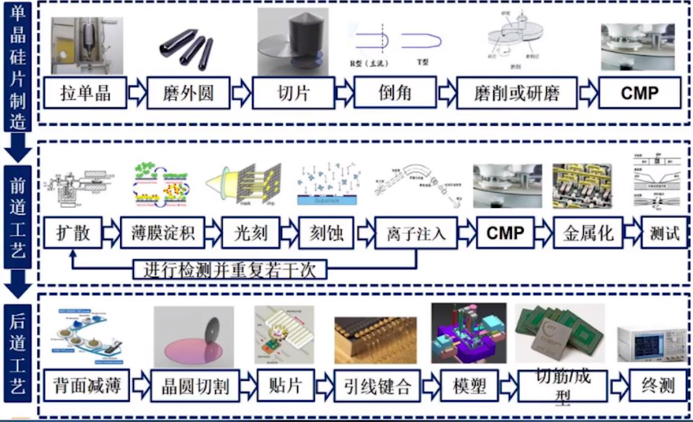
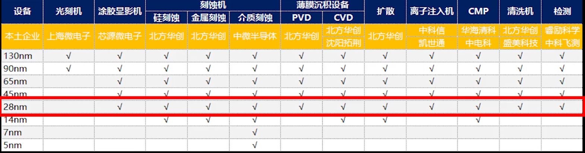

# The Situation of Mainstream High and New Tech

## 科技状况总论

* 第四次工业革命中的五大新科技领域：`碳基材料、基因工程、人工智能、量子科学、核聚变`
* 美国的四大优势：`高科技、美元、美军、好莱坞`
* 计算机视觉九大应用场景：`人脸识别、视频/监控分析、图像识别分析、辅助/自动驾驶、三维图像视觉、工业视觉检测、医疗影像诊断、文字识别、图像及视频编辑`
* 计算机视觉技能树：
  ```
  基础技能：相机原理、3D计算机视觉、low-level视觉与图像处理、视觉神经科学、统计机器学习、深度学习、线性代数、数学分析、概率论与数理统计
  中间层技能：图像分割、图像分类、目标检测、目标跟踪、视频（序列图像）分析
  应用层技能：OCR、图像检索、图形识别、视频内容理解（直播鉴黄、盗版检测等）、手势识别、人脸识别、图像/视频编辑和风格化、智能视频分析、
          图像与NLP结合、3D重建、工业视觉、无人驾驶、医疗影 像诊断、神经网络芯片
  ```

## 芯片制造

* 摩尔定律：`当价格不变时，集成电路上可容纳的元器件的数目，约每隔18-24个月便会增加一倍，性能也将提升一倍。`
* 芯片制造的八大材料：`硅片、电子特气、光掩模、光刻胶、光刻胶辅助材料、湿化学品、靶材、抛光`
* 芯片制造的八大设备：`扩散、薄膜沉积、光刻、刻蚀、离子注入、CMP抛光、清洗、测试`
* 完整的芯片制造包括三大部分：`单晶硅片制造；前道工序；后道工序`。每部分又依次分别包括以下几部分
  ```
  单晶硅片制造：拉单晶、磨外圆、切片、倒角、磨削或研磨、CMP
  前道工序：扩散、薄膜沉积、光刻、刻蚀、离子注入、CMP、金属化、测试
  后道工序：背面减薄、晶圆切割、贴片、引线键合、模塑、切筋/成型、终测
  ```

* 芯片代工厂国产技术设备发展状况（截止到2020年11月）


